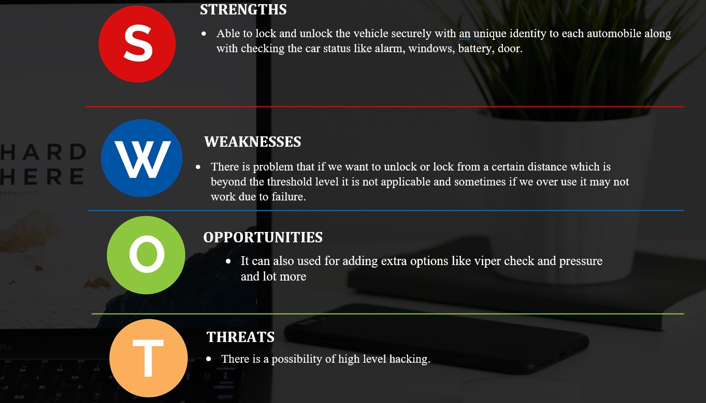
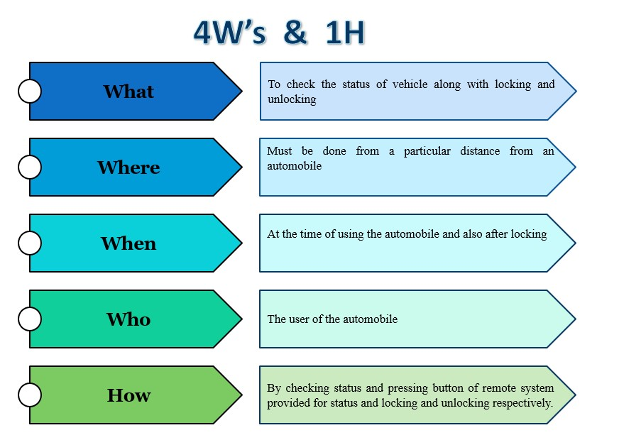

# Problem Statement
As we know that there is RKE system which is only unidirectional here we use BiCom system which can be bidirectional.
# Introduction
Here it is similar to RKE where it is used for locking and unlocking of automobiles but there it is only of unidirectional but here it is used as bidirectional means here BiCom operates by radio waves on a particular frequency bidirectionally unlike RKE where it acts unidirectionally here it also provide entire car status on a LED where we can manage all the operations of an automobile.
# Description
  Now a days as we are noticing that many of the automobiles work on this framework it is widely used for remotely lock or unlock vehicles.Here as said similar to RKE but different in functionality.The difference in functionality is BiCom system is the extention of the unidirectional RKE to bidirectional RKE system. keyfob -> car (like a unidirectional RKE system) car -> keyfob (car status information for displaying on the keyfob by LED or display) Typical BiCom status information transmitted to the keyfob are: Print window status (Blue switch on- All led on at the same time).Print alarm status - (Blue switch press two times- All led off at the same time.Print car battery info – (Blue switch press three times- All led on in clockwise manner).Print Door status (Blue switch press four times- All led on in anti-clockwise manner).These are the major points we come across when we compare both the systems.
## High Level Requirements
|ID|Descrption|Status|
|--|----------|------|
|HR01|window status|Implemented|
|HR02|alarm status|Implemented|
|HR03|Battery information|Implemented|
|HR04|locking and unlocking(Door status)|Implemented|
|HR05|Radio and music system status|Not Implemented|

## Low Level Requirements
|ID|Description|Status|
|--|-----------|------|
|LR01|User can select required action either locking or unlocking|Implemented|
|LR02|Vehicle Status |Implemented|
|LR03|Pressure status|Not implemented|
# SWOT

# 4W's & 1H
     
        
